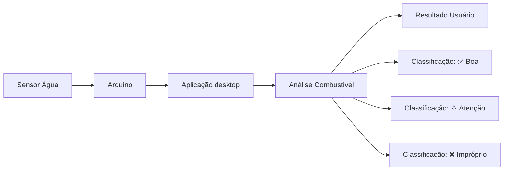
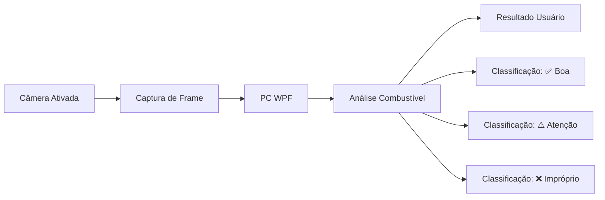
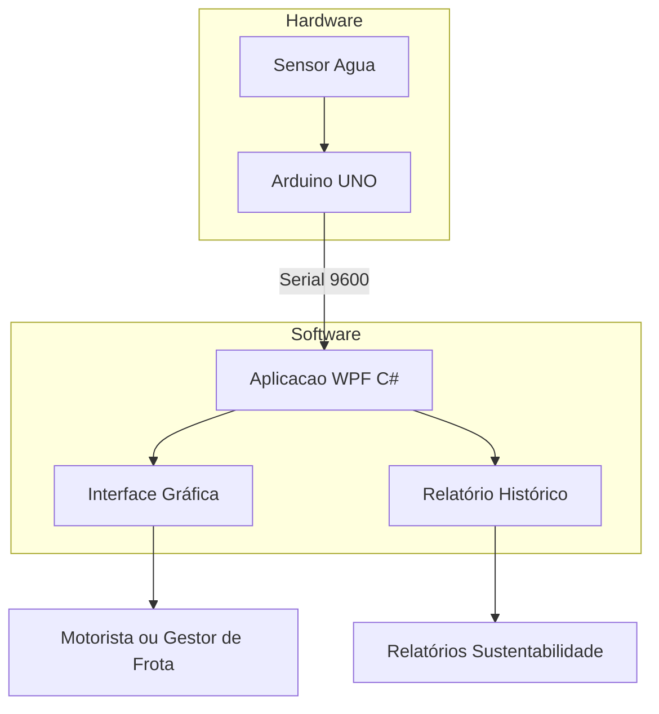
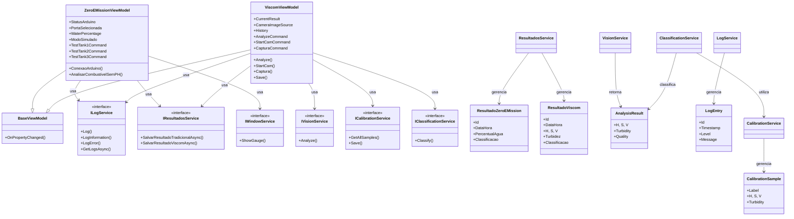

<h1 align='center'>Grupo Vector</h1>

<p align="center">
  
</p>

Alunos: Maycon Siqueira de Moraes, Pedro Henrique Moura da Silva <br>
Curso: Desenvolvimento de Sistemas <br>
Instrutor: Frederico Martins Aguiar <br>

## Sumário

- [1. Visão Geral](#1-visão-geral)
- [2. Tecnologias Utilizadas](#2-tecnologias-utilizadas)
- [3. Casos de Uso](#3-casos-de-uso)
  - [3.1 Módulo: Zero-E-Mission (Tradicional)](#31-módulo-zero-e-mission-tradicional)
  - [3.2 Módulo Viscom](#32-módulo-viscom)
- [4. Funcionamento do Sistema](#4-funcionamento-do-sistema)
  - [4.1 Zero-E-Mission (Tradicional)](#41-zero-e-mission-tradicional) 
  - [4.2 Viscom](#42-viscom)
- [5. Diagramas de Sequência](#5-diagramas-de-sequência)
  - [5.1 Módulo Zero-E-Mission (Tradicional)](#51-módulo-zero-e-mission-tradicional)
  - [5.2 Módulo Viscom](#52-módulo-viscom)
- [6. Arquitetura do Sistema](#6-arquitetura-do-sistema)
- [7. Arquitetura de Banco de Dados](#7-arquitetura-de-banco-de-dados)
- [8. Modelo e Persistência](#8-modelo-e-persistência)
  - [8.1 Diagrama de Classes](#81-diagrama-de-classes)
  - [8.2 Módulo Zero-E-Mission (Tradicional)](#82-módulo-zero-e-mission-tradicional)
  - [8.3 Módulo Viscom](#83-módulo-viscom)
- [9. Modelagens](#9-modelagens)
  - [9.1 Diagrama Físico Entidade-Relacionamento (MER)](#91-diagrama-físico-entidade-relacionamento-mer)
  - [9.2 Modelagem de Domínio](#92-modelagem-de-domínio)
- [10. Código do Arduino](#10-código-do-arduino)
- [11. Código do WPF](#11-código-do-wpf)
- [12. Levantamento de Requisitos](#12-levantamento-de-requisitos)
  - [12.1 Requisitos – Módulo Zero-E-Mission (Tradicional)](#121-requisitos---módulo-zero-e-mission-tradicional)
  - [12.2 Requisitos – Módulo Viscom](#122-requisitos--módulo-viscom)
  - [12.3 Requisitos comuns a ambos os módulos](#123-requisitos-comuns-a-ambos-os-módulos)
- [13. Sistema de Registro de Logs](#13-sistema-de-registro-de-logs)
  - [13.1 Visão Geral](#131-visão-geral)
  - [13.2 Arquitetura do Sistema de Logs](#132-arquitetura-do-sistema-de-logs)
  - [13.3 Modelo de Dados](#133-modelo-de-dados)
  - [13.4 Níveis de Log](#134-níveis-de-log)
  - [13.5 Funcionalidades do Sistema de Logs](#135-funcionalidades-do-sistema-de-logs)
  - [13.6 Principais Colaborações para o Software](#136-principais-colaborações-para-o-software)
  - [13.7 Fluxo de Uso no Sistema](#137-fluxo-de-uso-no-sistema)
  - [13.8 Configuração e Instalação](#138-configuração-e-instalação)
  - [13.9 Localização do Banco de Dados](#139-localização-do-banco-de-dados)
  - [13.10 Benefícios para o Desenvolvimento e Manutenção](#1310-benefícios-para-o-desenvolvimento-e-manutenção)
  - [13.11 Exemplos de Registros no Sistema](#1311-exemplos-de-registros-no-sistema)
  - [13.12 Considerações Finais](#1312-considerações-finais)
- [14. Documentação](#14-documentação)
- [15. Impacto Sustentável](#15-impacto-sustentável)
- [16. Referências Bibliográficas](#16-referências-bibliográficas)

## 1. Visão Geral

<h1 align='center'>🚛 Projeto Zero-E-Mission</h1>
<h2 align='center'>Análise de Combustível em Tempo Real</h2>

O **Zero-E-Mission** é um sistema que integra **Arduino + C# WPF** para monitorar em tempo real a **qualidade do combustivel Diesel/Biodiesel** em caminhões e frotas industriais.  

Com foco na **redução da pegada de carbono** e no uso mais **eficiente de energia**, o projeto ajuda a:
- Detectar **água no combustivel** (principal fator de danos e emissoes extras).  
- Monitorar a **densidade e proporção Diesel/Biodiesel**.  
- Classificar o combustível em **boa qualidade, atenção ou impróprio para uso**.  
- Orientar sobre **descarte correto**, evitando contaminação ambiental.

O módulo **Viscom**, incorporado ao sistema Zero-E-Mission, é uma aplicação desktop baseada em WPF que utiliza uma arquitetura MVVM (Model-View-ViewModel) para realizar análises de qualidade de amostras de combustível através de visão computacional.
O sistema captura imagens via Webcam, e processa informações como:
- H - Hue (Matiz): Representa a cor predominante do combustível.
- S - Saturation (Saturação): Mede o quanto a cor é intensa ou pura.
- V - Value (Valor): Mede a luminosidade da cor, ou quão clara ou escura ela é.
- Turbidez: Representa a variação do brilho dentro da imagem, ou seja, o quanto a luz é espalhada ao atravessar o líquido.  

---

## 2. Tecnologias Utilizadas
- **Arduino UNO/Nano** → Leitura do sensor de água (porta A0).  
- **Sensor de umidade/condutividade** → Detecta presença de água no combustível.  
- **C# / WPF** → Interface desktop intuitiva e responsiva.  
- **Comunicação Serial (COMx)** → Integração Arduino ↔ Aplicação.  

---

## 3. Casos de Uso

## 3.1 Módulo: Zero-E-Mission (Tradicional)

Este módulo gerencia o controle de hardware via Arduino, simulação de dados de tanques e acionamento de atuadores (motor).

### Diagrama de Caso de Uso Zero E Mission (Tradicional)

<p align="center">
  
</p>

"A imagem acima refere as interações do Operador com as funcionalidades de hardware e análise de combustível no sistema Tradicional"

### Tabela de Casos de Uso

| Caso de Uso | Ator & Pré-condições | Fluxo Principal / Alternativo | Validações & Regras de Negócio |
| :---------- | :------------------- | :---------------------------- | :----------------------------- |
| **UC01: Conectar / Desconectar Arduino** | **Ator:** Operador.<br><br>**Pré-condição:** Portas seriais listadas na inicialização. | **Conexão:**<br>1. Seleciona a porta COM.<br>2. Executa `ConectarArduinoCommand`.<br>3. O sistema abre a porta a 9600 bps e define o status como "Conectado".<br><br>**Desconexão:**<br>1. Com status "Conectado", clica novamente.<br>2. O sistema fecha a porta e limpa a tela . | - Se nenhuma porta for selecionada, exibe erro e recarrega a lista.<br>- Se `ModoSimulado` for falso e escolher "COM99", impede a conexão.<br>- Se `ModoSimulado` for verdadeiro e a porta não for "COM99", alerta o usuário. |
| **UC02: Gerenciar Configurações (Simulação e Motor)** | **Ator:** Operador.<br><br>**Pré-condição:** Interface carregada. | **Alternar Simulação:**<br>1. Executa `ModoSimuladoCommand`.<br>2. Inverte o booleano `ModoSimulado` e atualiza o texto de status na tela.<br><br>**Alternar Motor:**<br>1. Executa `HabilitaMotorCommand`.<br>2. Inverte `HabilitaAcionamentoMotor` e atualiza o status textual. | - Ativar o modo simulado adiciona artificialmente a porta "COM99" à listagem de portas. |
| **UC03: Analisar Amostra de Combustível** | **Ator:** Operador.<br><br>**Pré-condição:** Sistema conectado (real ou simulado). | 1. Solicita análise do Tanque 1, 2 ou 3.<br>2. O sistema zera os gráficos e abre a janela do medidor (`ShowGauge`).<br>3. **Modo Real:** Envia comando ("T1", "T2", "T3") via serial e lê a resposta.<br>4. **Modo Simulado:** Assume valores fixos (T1=60, T2=90, T3=0).<br>5. Atualiza o gráfico (`WaterPercentage`) e o ângulo do ponteiro (-90° a 90°).<br>6. Classifica o resultado e salva no banco de dados. | - Invoca o método de validação `ControledeConexao` antes da análise.<br>- Retorna erro se a resposta do Arduino não puder ser convertida para número.<br>- Bloqueia a ação se o sistema estiver desconectado. |

### Matriz de Regras de Classificação e Efeitos

| Faixa de Água (%) | Classificação | Cor / Estilo do Card | Ações Automatizadas |
| :---------------- | :------------ | :------------------- | :------------------ |
| **< 23%** | ✅ Boa Qualidade | Fundo Verde (`Colors.MediumSeaGreen`) | - Exibe cálculo de emissões de CO2 evitadas baseadas no veículo Iveco Daily.<br>- Se o motor estiver habilitado, envia serial "ON", toca áudio MP3 do motor por 3 segundos e envia "OFF". |
| **23% a 72%** | ⚠️ Traços de Água | Fundo Amarelo (`Colors.Gold`) | - Exibe recomendação de filtragem ou decantação antes do uso do combustível. |
| **≥ 73%** | ❌ Contaminado | Fundo Vermelho (`Colors.Crimson`) | - Alerta sobre risco de danos ao motor e ineficiência.<br>- Recomenda substituição imediata e descarte ecológico. |

---

## 3.2 Módulo Viscom 

Este módulo gerencia a captura de vídeo em tempo real, processamento de imagens com OpenCV e classificação colorimétrica/turbidez.

### Diagrama de Caso de Uso Viscom

<p align="center">
  
</p>

"A imagem acima detalha as funcionalidades que o Operador tem disponível para acesso ao Viscom."

### Tabela de Casos de Uso

| Caso de Uso | Ator & Pré-condições | Fluxo Principal / Alternativo | Validações & Regras de Negócio |
| :---------- | :------------------- | :---------------------------- | :----------------------------- |
| **UC04: Controlar Transmissão da Câmera** | **Ator:** Operador.<br><br>**Pré-condição:** Câmera de vídeo conectada ao computador. | **Iniciar Câmera:**<br>1. Executa `StartCamCommand`.<br>2. Instancia `VideoCapture` via DirectShow (DSHOW).<br>3. Dispara timer a ~60 FPS para atualizar o frame (`CameraImageSource`).<br><br>**Parar Câmera:**<br>1. Executa `StopCamCommand`.<br>2. Para o timer, libera os recursos da câmera e limpa os campos da tela. | - Evita múltiplas instâncias da câmera checando se o objeto já existe.<br>- Se a câmera não abrir, limpa os recursos e exibe mensagem de erro ao usuário. |
| **UC05: Capturar Amostra Estática** | **Ator:** Operador.<br><br>**Pré-condição:** Transmissão da câmera ativa (`CurrentFrame` não nulo). | 1. Executa `CapturaCommand`.<br>2. O sistema faz um clone exato do frame atual (`_capturedMat`).<br>3. Converte a imagem estática para exibição no painel lateral (`FotoImageSource`). | - Se não houver transmissão ao vivo (`_currentFrame` nulo), a ação é abortada. |
| **UC06: Analisar Amostra por Visão Computacional** | **Ator:** Operador.<br><br>**Pré-condição:** Foto da amostra previamente capturada. | 1. Executa `AnalyzeCommand`.<br>2. `VisionService` extrai métricas HSV (Matiz, Saturação, Valor), Turbidez e Separação de fases.<br>3. `ClassificationService` define a qualidade da amostra.<br>4. Insere o registro no topo do histórico da tela (`History`).<br>5. Atualiza os dados do card principal e salva no banco de dados. | - Bloqueia a análise e exibe mensagem se o usuário não capturou uma foto estática antes.<br>- Remove automaticamente textos indesejados da string de qualidade usando expressões regulares (Regex). |
| **UC07: Calibrar Padrão de Combustível** | **Ator:** Operador.<br><br>**Pré-condição:** Foto da amostra padrão capturada na tela. | 1. Executa `CalibrateCommand`.<br>2. Abre uma caixa de diálogo do MahApps Metro solicitando o rótulo do combustível.<br>3. O usuário digita o identificador (ex: "s10_bom", "agua") e confirma.<br>4. O sistema analisa a imagem e salva os parâmetros HSV e turbidez vinculados à etiqueta.<br>5. Exibe um relatório com os valores fixados. | - Bloqueia a calibração se não houver uma foto capturada na tela .<br>- Valida se o texto inserido pelo usuário não é vazio ou nulo. |
| **UC08: Exportar Histórico de Análises** | **Ator:** Operador.<br><br>**Pré-condição:** Existência de pelo menos uma análise no histórico. | 1. Executa `SaveCommand`.<br>2. Abre a janela `SaveFileDialog` sugerindo nome de arquivo datado.<br>3. O sistema usa `CsvWriter` para gerar o arquivo com codificação UTF-8.<br>4. Formata a saída usando ponto e vírgula (`;`) e padrão numérico brasileiro. | - Bloqueia a exportação se o histórico estiver vazio.<br>- Força a gravação de campos numéricos (float/double) limitados a exatamente 2 casas decimais. |
| **UC09: Limpar Histórico** | **Ator:** Operador.<br><br>**Pré-condição:** Interface carregada. | 1. Executa `ClearHistoryCommand`.<br>2. Limpa a lista interna `History`.<br>3. Redefine as variáveis do card para o modo de espera. | - Se o histórico já estiver vazio, exibe uma mensagem informativa ao operador antes de prosseguir. |

---

## 4. Funcionamento do Sistema

### 4.1 Zero-E-Mission (Tradicional)

### Diagrama de Fluxo

<p align="center">
  
</p>

"A imagem acima detalha o fluxo de funcionamento do software com base nas interações do usuário e as respostas de leituras das amostras de combustivel"

### Fluxograma

<p align="center">
  
</p>

"As figuras acima demonstram o fluxo da aplicação Tradicional, iniciando pela validação da conexão do sistema (via modo simulado com variáveis fixas ou integração com o Arduino), 
até a análise de qualidade. Detalha as condições para exibição dos alertas na interface do usuário, e a atualização dos componentes visuais (Gauge e gráficos de água), 
a persistência dos logs no banco de dados e as condições de segurança para o acionamento do motor."

### Fluxo de Dados


"A imagem acima detalha o fluxo percorrido pelo dado dentro da aplicação em todas as etapas, começando na leitura e por fim indo ate a classificação final"

### 4.2 Viscom 

### Diagrama de Fluxo

<p align="center">
  
</p>

"O diagrama acima descreve o fluxo de funcionamento do sistema de visão computacional de acordo com a interação do usuário e a resposta da análise do frame de imagem."

### Fluxograma

<p align="center">
  
</p>

"As figuras acima demonstram o fluxo do módulo de visão computacional Viscom, detalhando as etapas de captura e processamento de imagem: inicializa a câmera, 
aquisição da imagem de amostra, tratamento de exceções e validação da calibração. Após o processamento da imagem, detalha os dados que englobam a exibição imediata 
no painel de histórico da interface, a persistência de logs e métricas no banco de dados, e as rotinas de manutenção (limpeza de histórico) e exportação de 
relatórios estruturados em formato CSV(tabela Excel)."

### Fluxo de Analise


- É disparado um comando que clona o frame estático retido na webcam e ocorre o processamento da imagem
- Os resultados extraídos formam strings interpretáveis (textos para cor H - Matiz, S - Saturação, V - Brilho, detecção de fase e resultado da análise), que aparecem na interface do Viscom
- O painel de resultado é atualizado e será exibido a conclusão da análise do combustível: indicando verde (✅) para aprovação, amarelo (⚠️) para aviso e vermelho (❌) para reprovação

---

## 5. Diagramas de Sequência

### 5.1 Módulo Zero-E-Mission (Tradicional)

Este diagrama representa o processo de análise de qualidade do combustível utilizando o sensor de água conectado ao Arduino. 
O usuário solicita o teste do Tanque 1, o sistema valida a conexão, envia o comando "T1" para o Arduino, processa a resposta, 
classifica o combustível, atualiza a interface e persiste o resultado no banco de dados.

<p align="center">
  
</p>

“A Figura acima apresenta o diagrama de sequência do fluxo de análise por sensor de água, onde o usuário solicita o teste do Tanque 1, 
o sistema valida a conexão, envia o comando para o Arduino e processa a resposta, atualizando a interface em tempo real.”

### 5.2 Módulo Viscom

<p align="center">
  
  
  
</p>

“O fluxo de análise por visão computacional, representado na Figura acima, demonstra a sequência de captura de frames, extração de métricas, 
classificação com base em calibração e persistência dos resultados.”

---

### 6. Arquitetura do Sistema



"A imagem acima apresenta a arquitetura do sistemas em cada uma das etapas"

---

### 7. Arquitetura de Banco de Dados

O gerenciamento de dados é centralizado e construído sobre o SQLite, garantindo que o banco de dados seja criado e mantido localmente na máquina do usuário.

- O banco de dados é gerenciado através da classe estática **Database**.
- O sistema utiliza a biblioteca Microsoft.Data.Sqlite para realizar a conexão.
- O arquivo físico do banco, chamado ***vectorzerovis.db***, é armazenado no diretório **%ApplicationData%\Vector_ZeroEmission**.
- O diretório e o arquivo do banco de dados são criados automaticamente na inicialização da classe, caso ainda não existam no sistema do usuário.
- A inicialização do banco cria a tabela **AnaliseViscom**, que é estruturada com as colunas: **Id_Viscom, Data_Hora, Hue_Matiz, Saturation_Saturacao, Value_Valor, Separacao_Fase e Resultado**.
- Uma segunda tabela chamada **AnaliseZeroEmissio** também é provisionada neste arquivo, contendo as colunas **Id_Zero, Porcentagem_Agua e Resultado**.

---

### 8. Modelo e Persistência

A representação dos dados na aplicação e sua persistência são separadas de forma clara entre as classes de modelo (Model) e repositório (Repository).

### 8.1 Diagrama de Classes



### 8.2 Módulo **Zero-E-Mission** (Tradicional)

<p align="center">
  
</p>

A tabela estrutural para propriedades lidas nos testes em tempo real por meio de sensores é refletida na classe modelo **ResultadoZeroEMission** (mapeada para a tabela `ResultadoZeroEMission`).

| Propriedade                | Tipo       | Descrição                                                                                           |
| :------------------------- | :--------- | :-------------------------------------------------------------------------------------------------- |
| **Id**                     | *int*      | Identificador único e auto-incremental do resultado (Chave Primária).                               |
| **DataHoraAnalise**        | *DateTime* | Data e horário exatos em que a análise por sensores ocorreu.                                        |
| **TituloResultado**        | *string*   | Título descritivo do resultado da análise (Máx. 500 caracteres).                                    |
| **DescricaoResultado**     | *string*   | Descrição detalhada do resultado obtido (Máx. 2000 caracteres).                                     |
| **PercentualAgua**         | *double*   | Métrica do sensor indicando o percentual de água detectado na amostra.                              |
| **LeituraSensor**          | *double*   | Valor da leitura direta obtida através do sensor industrial.                                        |
| **AnguloGauge**            | *double*   | Ângulo calculado para a renderização do ponteiro no Gauge visual da interface.                      |
| **TextoGauge**             | *string*   | Texto descritivo exibido de forma dinâmica juntamente ao Gauge.                                     |
| **ClassificacaoQualidade** | *string*   | Classificação final de qualidade calculada a partir dos sensores (Máx. 200 caracteres).             |
| **IconeStatus**            | *string*   | Ícone ou indicador de status visual representado por emoji (✅, ⚠️, ❌).                           |
| **CorIndicador**           | *string*   | Código ou nome da cor associada ao estado do indicador visual (Máx. 50 caracteres).                 |
| **RecomendacoesAcoes**     | *string*   | Recomendações e ações sugeridas com base no diagnóstico do sensor (Máx. 1000 caracteres).           |
| **ModoSimulado**           | *bool*     | Indicador booleano que define se a análise veio de um simulador ou de um sensor físico.             |
| **PortaCOM**               | *string*   | Identificação da porta de comunicação serial utilizada para ler o dispositivo (Máx. 50 caracteres). |

### 8.3 Módulo **Viscom**

<p align="center">
  
</p>

A tabela estrutural para propriedades lidas nos testes em tempo real por visão computacional é refletida na classe modelo **ResultadoViscom** (mapeada para a tabela `ResultadosMetodoViscom`).

| Propriedade                | Tipo       | Descrição                                                                                             |
| :------------------------- | :--------- | :---------------------------------------------------------------------------------------------------- |
| **Id**                     | *int*      | Identificador único e auto-incremental da análise (Chave Primária).                                   |
| **DataHoraAnalise**        | *DateTime* | Data e horário exatos em que a análise de visão computacional ocorreu.                                |
| **TituloResultado**        | *string*   | Título descritivo do resultado da análise (Máx. 500 caracteres).                                      |
| **DescricaoResultado**     | *string*   | Descrição detalhada do resultado obtido via processamento de imagem (Máx. 2000 caracteres).           |
| **ValorH**                 | *double*   | Valor do componente de cor Matiz (Hue) obtido no espaço de cores HSV da imagem.                       |
| **ValorS**                 | *double*   | Valor do componente de Saturação (Saturation) obtido no espaço de cores HSV.                          |
| **ValorV**                 | *double*   | Valor da propriedade de Brilho/Valor (Value) obtido no espaço de cores HSV.                           |
| **Turbidez**               | *double*   | Métrica de qualidade que indica o nível de turbidez detectado visualmente no fluido.                  |
| **SeparacaoDeFases**       | *bool*     | Indicador booleano para a detecção automática de separação de fases físicas.                          |
| **ClassificacaoQualidade** | *string*   | Classificação final do nível de qualidade estimado pela visão computacional (Máx. 200 caracteres).    |
| **IconeStatus**            | *string*   | Ícone ou indicador de status visual representado por emoji (✅, ⚠️, ❌).                             |
| **ObservacoesAdicionais**  | *string*   | Contexto e anotações adicionais estruturadas para o uso e recuperação via RAG (Máx. 1000 caracteres). |

---

## 9. Modelagens

### 9.1 Diagrama Físico Entidade-Relacionamento (MER)

<p align="center">
  
</p>

"O Diagrama Entidade-Relacionamento (MER) do sistema Vector – Zero Emission representa a estrutura lógica dos dados que serão armazenados no banco de dados SQLite. Este modelo é fundamental para compreender como as informações são organizadas, persistidas e relacionadas entre si, servindo como base para a implementação do banco de dados via Entity Framework Core."

### 9.2 Modelagem de Domínio

<p align="center">
  
</p>

"O Zero-E-Mission centraliza e processa informações em tempo real vindas de duas fontes: ele recebe os dados dos sensores de análise de combustível por meio de uma porta serial (módulo Tradicional) e coordena as capturas de imagem de uma câmera conectada via USB (módulo Viscom). Por fim, todas as leituras, logs e dados operacionais coletados são gravados diretamente em um banco de dados SQLite local, permitindo que todo o conjunto funcione de forma independente e autônoma."

---

## 10. Código do Arduino
```cpp
/// <summary>
/// Controla a leitura de sensores de presença de água e acionamento de relés para motor V8(Motor do protótipo).
/// 
/// O programa monitora três sensores analógicos (T1, T2, T3) conectados às portas A0, A1 e A2,
/// calcula a porcentagem de nível de cada tanque e permite controle remoto via porta serial.
/// 
/// Comandos suportados via Serial (terminados com \n):
/// <list type="bullet">
/// <item><description><c>T1</c> - Retorna a porcentagem do nível do Tanque 1 (A0)</description></item>
/// <item><description><c>T2</c> - Retorna a porcentagem do nível do Tanque 2 (A1)</description></item>
/// <item><description><c>T3</c> - Retorna a porcentagem do nível do Tanque 3 (A2)</description></item>
/// <item><description><c>ON</c> - Liga o relé 1 (aciona o motor)</description></item>
/// <item><description><c>OFF</c> - Desliga o motor com segurança: aguarda 12s, desativa relé 1 e 
/// ativa relé 2 por 500ms para desligar o dispositivo</description></item>
/// </list>
/// 
/// <para><b>Funcionamento dos Relés:</b></para>
/// <list type="bullet">
/// <item><description><b>Relé 1 (pino 7):</b> Controla a ativação do motor (HIGH = ligado)</description></item>
/// <item><description><b>Relé 2 (pino 8):</b> Atuador de desligamento (pulso de 500ms para desligar)</description></item>
/// </list>
/// 
/// <para><b>Fórmula de Cálculo:</b></para>
/// <description>Percentual = (leitura_analógica / 1023.0) * 100.0</description>
/// <para>Onde a leitura varia de 0 a 1023, correspondendo a 0% a 100% do nível</para>
/// 
/// <para><b>Observações:</b></para>
/// <list type="bullet">
/// <item><description>O comando OFF possui um delay de 12 segundos antes de desligar, 
/// permitindo que o motor complete seu ciclo</description></item>
/// <item><description>O relé 2 é acionado apenas por 500ms (pulso) para evitar sobrecarga</description></item>
/// <item><description>A comunicação serial é feita a 9600 bauds</description></item>
/// </list>
/// </summary>
// Arduino - Sensor de água na porta A0-A1-A2
const int SensorTanque1 = A0;
const int SensorTanque2 = A1;
const int SensorTanque3 = A2;

int rele1 = 7;  // Pino do relé 1
int rele2 = 8;  // Pino do relé 2

void setup() {
  //setup dos relés para o controle do motor v8
  pinMode(rele1, OUTPUT);
  pinMode(rele2, OUTPUT);
  digitalWrite(rele1, LOW);
  digitalWrite(rele2, LOW);
  Serial.begin(9600);
}

void loop() {
  if (Serial.available() > 0) {
    String comando = Serial.readStringUntil('\n');
    comando.trim();

    int leitura = 0;
    float percentual = 0;

    if (comando == "T1") {
      leitura = analogRead(SensorTanque1);
    }
    if (comando == "T2") {
      leitura = analogRead(SensorTanque2);
    }
    if (comando == "T3") {
      leitura = analogRead(SensorTanque3);
    }

    if (comando == "ON") {
      digitalWrite(rele1, HIGH);
      //Serial.println("Rele 1 ligado");
    }
    else if (comando == "OFF") {
      delay(12000);
      digitalWrite(rele1, LOW);
      digitalWrite(rele2, HIGH); // ativa relé 2 para desligar dispositivo
      delay(500);
      digitalWrite(rele2, LOW);
      //Serial.println("Rele 2 acionado para desligar");
    }

    percentual = (leitura / 1023.0) * 100.0;
   Serial.println((int)percentual);
  }
}

```

---

## 11. Código do WPF

### A aplicação WPF recebe os dados do Arduino via porta serial e realiza:

### 1- Conversão dos valores recebidos.

### 2- Comparação com parâmetros (densidade e biodiesel).

### 3- Classificação do combustível.

### 4- Exibição do resultado com alertas visuais em cores.

## Qualidade do Combustível

<div align="center">

| Status           | Descrição                                                       |
| :--------------- | :-------------------------------------------------------------- |
| ✅ Boa Qualidade | Combustível pronto para uso.                                    |
| ⚠️ Atenção       | Combustível de baixa qualidade, recomenda-se aditivação.        |
| ❌ Impróprio     | Contém água, risco ao motor, recomenda-se o descarte ecológico. |

</div>

---

## 12. Levantamento de Requisitos

## 12.1 Requisitos - Módulo Zero-E-Mission (Tradicional)

###  Requisitos Funcionais

| Requisito | Descrição Detalhada |
| :-------- | :------------------ |
| **Análise sob Demanda (IoT)** | O sistema deve permitir que o usuário solicite a análise de qualidade do combustível por meio de botões específicos na interface (Tanques 1, 2 e 3). Ao ser acionado, deve buscar as informações do sensor de presença de água conectado à plataforma IoT (Arduino) via porta serial. |
| **Exibição dos Resultados (Gauge e Gráficos)** | Os dados de percentual de água recebidos devem ser processados e exibidos em tempo real através de: (a) mostrador analógico (gauge) com ponteiro animado e faixas de cores (verde, amarelo, vermelho); (b) gráfico dinâmico (LiveCharts); (c) card informativo com título, ícone (✅, ⚠️, ❌) e cor de fundo indicativa. |
| **Gerenciamento de Conexão IoT** | O sistema deve listar as portas COM disponíveis e permitir que o usuário selecione e altere a porta de comunicação para conectar/desconectar da plataforma IoT (Arduino), tratando falhas de conexão. |
| **Modo Simulado (Offline)** | O sistema deve oferecer um modo de simulação que dispensa o hardware real. Utiliza a porta virtual "COM99" e retorna valores fixos (60%, 90%, 0%) para permitir testes de interface, demonstrações e desenvolvimento sem a necessidade de equipamentos físicos. |
| **Classificação da Amostra (Água)** | Com base no percentual de água lido pelo sensor, o sistema deve classificar automaticamente o combustível em: **(1) Boa Qualidade** (< 23%); **(2) Com Traços de Água** (23% a 72%); **(3) Contaminado** (> 73%). Cada classificação gera uma mensagem específica e recomendações de ação (ex: descarte ecológico, filtragem). |
| **Acionamento do Motor (Demonstrativo)** | Quando o resultado for "Boa Qualidade" e a opção "Acionamento Motor" estiver habilitada, o sistema envia comandos "ON" e "OFF" via serial. **Funcionalidade demonstrativa** no protótipo. |
| **Feedback Sonoro (Demonstrativo)** | Ao final de uma análise bem-sucedida que resulte em "Boa Qualidade", o sistema reproduz um arquivo de áudio (`muscleTruckCuted.mp3`). **Funcionalidade demonstrativa**. |
| **Persistência de Dados (Arquivamento)** | O sistema deve salvar todas as análises realizadas (data/hora, percentual de água, classificação, recomendações, porta utilizada, status do modo simulado) em um banco de dados local via `ResultadosService`. |

### Requisitos Não Funcionais

| Requisito | Descrição Detalhada |
| :-------- | :------------------ |
| **Baixa Latência (Tempo de Resposta)** | As leituras devem ser realizadas em curtos períodos de tempo (milissegundos a poucos segundos), pois o sistema precisa verificar a situação atual do combustível antes da partida. |
| **Disponibilidade Contínua** | O software deve estar disponível e em pleno funcionamento na maior parte do tempo, especialmente no momento do abastecimento e pré-ignição. |
| **Plataforma de Hardware (IHM)** | Deve ser executado em Windows 10 ou superior. |
| **Configuração Mínima (Processador e Memória)** | Processador Intel Core i5 ou equivalente, 8 GB RAM. |
| **Recomendação de Placa de Vídeo (GPU)** | Aconselhável, mas não obrigatório, para melhor desempenho gráfico. |
| **Segurança (Autenticação)** | Não há necessidade de sistema de login ou criptografia, pois não há risco de acesso não autorizado em dispositivos embarcados. |
| **Manutenibilidade (Arquitetura)** | Segue o padrão MVVM para separação clara entre View, ViewModel e Model. |
| **Robustez (Tratamento de Erros)** | Deve tratar exceções de comunicação serial, parsing de dados e falhas no banco, exibindo mensagens amigáveis e registrando logs sem interromper a execução. |

### Requisitos Ampliados/Desejáveis

| Requisito | Descrição Detalhada |
| :-------- | :------------------ |
| **Integração com IA Local** | Futuramente, o módulo poderá usar IA para gerar insights preditivos com base nos dados de água, como alertas de recorrência de contaminação e otimização de consumo. |
| **Relatórios de Emissões Evitadas (combinado com Viscom)** | O cálculo de emissões será feito com base no tipo de combustível (identificado pelo Viscom) e no modelo do veículo, gerando métricas de kg CO2eq evitados. |

---

## 12.2 Requisitos – Módulo Viscom 

### Requisitos Funcionais

| Requisito | Descrição Detalhada |
| :-------- | :------------------ |
| **Captura de Vídeo da Câmera** | O sistema deve permitir iniciar e parar a transmissão ao vivo da câmera, exibindo o vídeo em tempo real na interface (via `CameraImageSource`). |
| **Captura de Frame Estático** | O sistema deve permitir que o usuário capture um frame estático do vídeo ao vivo, armazenando-o para análise ou calibração (propriedade `_capturedMat` e `FotoImageSource`). |
| **Análise de Imagem (Visão Computacional)** | A partir do frame capturado, o sistema deve extrair métricas visuais usando o `VisionService`: valores de H (matiz), S (saturação), V (valor), turbidez e detecção de separação de fases. |
| **Classificação da Qualidade do Combustível** | Com base nas métricas extraídas e nos padrões de calibração (`ClassificationService`), o sistema deve classificar a qualidade do combustível (ex: "✅ Combustível dentro dos padrões", "⚠️ Atenção", "❌ Contaminado") e gerar uma descrição detalhada. |
| **Identificação do Tipo de Combustível pela Cor** | Através da análise de imagem, o sistema deve identificar o tipo de combustível conforme a coloração: **Vermelho** → Diesel Comum; **Verde Claro** → Diesel S10/Biodiesel; **Tons Misturados** → Combustível misturado. Essa informação é usada no cálculo de emissões e na classificação. |
| **Calibração de Novas Amostras** | O sistema deve permitir que o usuário calibre novos padrões de amostra, informando um rótulo (ex: "S10_bom", "S500", "Contaminado"). A calibração utiliza o frame estático capturado e o `CalibrationService` para salvar as métricas de referência. |
| **Exibição do Resultado Atual** | O resultado da análise deve ser exibido em um card com ícone (✅, ⚠️, ❌, ℹ️), título (qualidade), descrição detalhada (valores H, S, V, turbidez, fase) e severidade (Neutral, Good, Warning, Bad) para estilização visual. |
| **Histórico de Análises em Memória** | O sistema deve manter um histórico (ObservableCollection) das últimas análises realizadas, exibindo data/hora, métricas e qualidade. |
| **Limpeza do Histórico** | O sistema deve permitir que o usuário limpe o histórico de análises e resete o resultado atual. |
| **Persistência no Banco de Dados** | O sistema deve salvar cada análise realizada (com todas as métricas, classificação, ícone, observações) no banco de dados via `ResultadosService.SalvarResultadoViscomAsync()`. |
| **Exportação para CSV** | O sistema permite exportar o histórico de análises para um arquivo CSV (tabela Excel), utilizando a biblioteca CsvHelper. |

### Requisitos Não Funcionais

| Requisito | Descrição Detalhada |
| :-------- | :------------------ |
| **Baixa Latência na Captura e Análise** | A captura de vídeo deve operar a ~60 FPS (conforme `DispatcherTimer` com 60ms) e a análise de um frame estático deve ser concluída em menos de 2 segundos para não prejudicar a experiência do usuário. |
| **Inicialização Rápida da Câmera** | A câmera deve ser inicializada e começar a exibir o vídeo em no máximo 1 segundo após o comando "Iniciar". |
| **Plataforma de Hardware (IHM)** | Deve ser executado em Windows 10 ou superior, com suporte a OpenCV e acesso à câmera. |
| **Configuração Mínima (Processador e Memória)** | Processador Intel Core i5 ou equivalente, 8 GB RAM (necessário para processamento de imagem em tempo real). |
| **Recomendação de Placa de Vídeo (GPU)** | Aconselhável para acelerar operações de visão computacional (OpenCV pode usar GPU), mas não obrigatório. |
| **Segurança (Autenticação)** | Não há necessidade de sistema de login, pois o dispositivo é embarcado e sem risco de acesso não autorizado. |
| **Manutenibilidade (Arquitetura)** | Segue o padrão MVVM e utiliza injeção de serviços (`VisionService`, `CalibrationService`, `ClassificationService`, `ResultadosService`) para separar responsabilidades. |
| **Robustez (Tratamento de Erros)** | Deve tratar exceções de câmera (falha ao abrir, desconexão), erros de processamento de imagem e falhas no banco, exibindo mensagens amigáveis e registrando logs. |
| **Usabilidade** | A interface deve fornecer feedback visual claro durante a calibração, análise e exportação, com mensagens de sucesso/erro via `ShowMessageAsync`. |

### Requisitos Ampliados Desejáveis

| Requisito | Descrição Detalhada |
| :-------- | :------------------ |
| **Integração com IA Local (Insights)** | Futuramente, o módulo poderá usar IA para, com base nas métricas de imagem (cor, turbidez), gerar alertas sobre qualidade do combustível, sugerir manutenção ou identificar padrões de contaminação recorrente. |
| **Relatórios de Emissões Evitadas (combinado com ZeroEmission)** | O tipo de combustível identificado pela análise de imagem deve ser usado, juntamente com parâmetros do veículo, para calcular e exibir as emissões de CO2 evitadas. Esse cálculo pode ser feito em um serviço comum. |

---

## 12.3 Requisitos comuns a ambos os módulos

| Requisito | Descrição Detalhada | Classe Responsável |
| :-------- | :------------------ | :----------------- |
| **Persistência em Banco de Dados** | Os resultados de ambos os módulos devem ser salvos no banco de dados local via `ResultadosService`, que possui métodos específicos para cada tipo de resultado (`SalvarResultadoTradicionalAsync` e `SalvarResultadoViscomAsync`). | Ambas (usam o mesmo serviço) |
| **Exportação para Excel** | Conforme informado, a exportação para Excel está implementada em uma classe separada (serviço) e pode ser usada por ambos os módulos para gerar relatórios completos. | Serviço externo (não nas ViewModels) |
| **Relacionamento de Informações** | Os dados de ambos os módulos (percentual de água e análise visual) podem ser relacionados no banco de dados para consultas cruzadas e geração de relatórios unificados. | Banco de dados e serviços |
| **Configuração de Hardware Mínima** | Ambos os módulos compartilham os mesmos requisitos de hardware: Windows 10+, i5, 8GB RAM, GPU recomendada. | - |
| **Arquitetura MVVM** | Ambas as ViewModels seguem o padrão MVVM e herdam de `BaseViewModel`. | - |
| **Tratamento de Exceções** | Ambas as classes utilizam `MensagemAoUsuario` e logs para tratar erros sem interromper a aplicação. | - |

---

# 13. Sistema de Registro de Logs 

## 13.1 Visão Geral

O sistema de registro de logs (logging) implementado no **Vector – Zero Emission** é uma camada de infraestrutura que permite rastrear, armazenar e consultar eventos, erros, avisos e atividades dos usuários durante a execução do software. Este sistema foi projetado para fornecer **rastreabilidade completa**, **auditoria** e **diagnóstico de falhas**, elementos essenciais para a manutenção e evolução do sistema.

---

## 13.2 Arquitetura do Sistema de Logs

### Estrutura de Camadas

```
┌─────────────────────────────────────────────────────────────┐
│                       CAMADA DE APRESENTAÇÃO                │
│  ┌──────────────────────────────────────────────────────┐   │
│  │  ViewModels (ZeroEMissionViewModel, ViscomViewModel) │   │
│  │  - Chama métodos de log para registrar eventos       │   │
│  └──────────────────────────────────────────────────────┘   │
├─────────────────────────────────────────────────────────────┤
│                       CAMADA DE SERVIÇOS                    │
│  ┌──────────────────────────────────────────────────────┐   │
│  │              ILogService / LogService                │   │
│  │  - Interface padronizada para registro de logs       │   │
│  │  - Métodos: Log, LogInformation, LogWarning, etc.    │   │
│  │  - Filtragem por nível de log                        │   │
│  └──────────────────────────────────────────────────────┘   │
├─────────────────────────────────────────────────────────────┤
│                      CAMADA DE DADOS                        │
│  ┌──────────────────────────────────────────────────────┐   │
│  │              AppDbContext / LogEntry                 │   │
│  │  - Tabela Logs no SQLite                             │   │
│  │  - Índices otimizados para consultas                 │   │
│  └──────────────────────────────────────────────────────┘   │
└─────────────────────────────────────────────────────────────┘
```

### Componentes Principais

| Componente        | Descrição                                                                      |
| ----------------- | ------------------------------------------------------------------------------ |
| **ILogService**   | Interface que define o contrato para o serviço de logs                         |
| **LogService**    | Implementação concreta que gerencia o armazenamento no SQLite                  |
| **LogEntry**      | Modelo de dados que representa um registro de log                              |
| **LogLevel**      | Enumeração que define os níveis de severidade                                  |
| **LogsDbContext** | Contexto do Entity Framework para a tabela de logs (integrado ao AppDbContext) |

---

## 13.3 Modelo de Dados

### Classe LogEntry

```csharp
public class LogEntry
{
    public int Id { get; set; }          // Identificador único
    public DateTime Timestamp { get; set; } // Data/hora do evento
    public string Level { get; set; }     // Nível do log (Information, Warning, Error, etc.)
    public string Source { get; set; }    // Origem do evento (classe/método)
    public string Message { get; set; }   // Mensagem descritiva
    public string? Details { get; set; }  // Detalhes adicionais (stack trace, dados extras)
    public string? User { get; set; }     // Usuário ou sessão (opcional)
    public string? Category { get; set; } // Categoria do log (Arduino, Analysis, Database, etc.)
}
```

### Estrutura da Tabela no SQLite

| Coluna    | Tipo         | Descrição                          |
| --------- | ------------ | ---------------------------------- |
| Id        | INTEGER (PK) | Chave primária autoincrement       |
| Timestamp | DATETIME     | Data e hora do evento              |
| Level     | TEXT         | Nível de severidade do log         |
| Source    | TEXT         | Fonte do evento (classe ou método) |
| Message   | TEXT         | Mensagem principal do log          |
| Details   | TEXT         | Informações adicionais (opcional)  |
| User      | TEXT         | Usuário ou identificador da sessão |
| Category  | TEXT         | Categoria do evento                |

### Índices para Performance

```sql
-- Índices criados automaticamente pelo Entity Framework
CREATE INDEX IX_Logs_Timestamp ON Logs(Timestamp);
CREATE INDEX IX_Logs_Level ON Logs(Level);
CREATE INDEX IX_Logs_Category ON Logs(Category);
CREATE INDEX IX_Logs_Source ON Logs(Source);
CREATE INDEX IX_Logs_Timestamp_Level ON Logs(Timestamp, Level);
```

---

## 13.4 Níveis de Log

O sistema define cinco níveis de severidade, permitindo filtrar logs por criticidade:

| Nível           | Uso             | Descrição                                                                          |
| --------------- | --------------- | ---------------------------------------------------------------------------------- |
| **Debug**       | Desenvolvimento | Informações detalhadas para depuração. Ex: valores de variáveis, estado do sistema |
| **Information** | Operacional     | Eventos normais e esperados. Ex: inicialização, conexão, conclusão de análise      |
| **Warning**     | Atenção         | Situações anormais mas não críticas. Ex: porta não encontrada, resposta inválida   |
| **Error**       | Erros           | Falhas que não impedem a execução principal. Ex: falha ao salvar no banco          |
| **Critical**    | Crítico         | Falhas que impedem a operação do sistema. Ex: erro fatal de inicialização          |

---

## 13.5 Funcionalidades do Sistema de Logs

### Registro de Eventos

O sistema oferece métodos específicos para cada nível de log, facilitando a manutenção do código:

```csharp
// Registro de informações operacionais
_logger.LogInformation("ConectarArduino", "Arduino conectado com sucesso", category: "Arduino");

// Registro de avisos
_logger.LogWarning("TestAmostra", "Resposta inválida do Arduino", category: "Analysis");

// Registro de erros
_logger.LogError("SalvarResultado", "Falha ao salvar no banco de dados", category: "Database");

// Registro de exceções completas com stack trace
_logger.LogException("ConexaoArduino", ex, "Falha ao abrir porta serial", category: "Arduino");

// Registro de depuração (desativado em produção)
_logger.LogDebug("AtualizarGauge", $"Gauge atualizado: {valor}%", category: "UI");
```

### Consulta de Logs

```csharp
// Obtém os últimos 200 logs
var logs = await _logger.GetLogsAsync(limit: 200);

// Filtra por nível e categoria
var errors = await _logger.GetLogsAsync(level: "Error", category: "Database");

// Filtra por período
var logsDoMes = await _logger.GetLogsAsync(
    from: DateTime.Now.AddDays(-30),
    to: DateTime.Now
);
```

### Manutenção de Logs

```csharp
// Remove logs mais antigos que 30 dias
await _logger.ClearOldLogsAsync(daysToKeep: 30);

// Remove todos os logs (daysToKeep = 0)
await _logger.ClearOldLogsAsync(0);
```

### Métodos de Extensão

Para facilitar o uso, o sistema fornece métodos de extensão que capturam automaticamente o nome do método chamador:

```csharp
// Usando extension methods
_logger.LogInfo("Iniciando teste", category: "Analysis");
_logger.LogWarning("Resposta inválida", category: "Arduino");
_logger.LogError("Falha na conexão", category: "Database");
_logger.LogException(ex, "Erro durante análise", category: "Analysis");
```

---

## 13.6 Principais Colaborações para o Software

### Rastreabilidade de Erros

O sistema de logs permite identificar rapidamente a origem e o contexto de falhas:

- **Stack trace completo** de exceções é armazenado no campo `Details`
- **Identificação da fonte** (classe e método) permite localizar rapidamente o problema
- **Categorização** por módulo facilita a triagem de incidentes

**Exemplo de uso:**
```csharp
catch (Exception ex)
{
    _logger.LogException("ConexaoArduino", ex, 
        $"Falha na conexão com porta {PortaSelecionada}", 
        category: "Arduino");
    // O log armazenará: classe, método, mensagem, stack trace
}
```

### Auditoria de Operações

Todos os eventos importantes são registrados, permitindo auditar as operações realizadas:

- **Conexões e desconexões** do Arduino
- **Testes de tanques** realizados (T1, T2, T3)
- **Classificações de combustível** (boa qualidade, traços, contaminado)
- **Alterações de configuração** (modo simulado, habilitação do motor)
- **Salvamento de resultados** no banco de dados

### Diagnóstico de Performance

Os logs permitem identificar gargalos e problemas de performance:

```csharp
_logger.LogDebug("UpdateFrame", 
    $"Frame processado em {elapsed.TotalMilliseconds}ms", 
    category: "Performance");
```

### Histórico de Eventos

Com o armazenamento persistente, é possível:

- **Revisar eventos passados** para entender causas de problemas
- **Analisar padrões** de falhas ou comportamentos
- **Gerar relatórios** de atividades do sistema
- **Correlacionar eventos** para diagnóstico de problemas complexos

### Suporte a Debug

Durante o desenvolvimento, o sistema fornece informações detalhadas:

```csharp
_logger.LogDebug("TestAmostraTanque1", 
    $"Resposta recebida: {resposta}, Valor convertido: {valorSensor}", 
    category: "Analysis");
```

### Integração com o Sistema Existente

O sistema de logs foi projetado para integrar-se perfeitamente ao projeto existente:

- **Reutilização do AppDbContext** existente (não cria novas conexões)
- **Injeção de dependência** com o padrão já adotado no projeto
- **Não interfere** no fluxo principal da aplicação
- **Desempenho otimizado** com índices no banco de dados

---

## 13.7 Fluxo de Uso no Sistema

### Exemplo no ZeroEMissionViewModel

```
┌─────────────────────────────────────────────────────────────────┐
│                      ZERO EMISSION VIEWMODEL                    │
├─────────────────────────────────────────────────────────────────┤
│                                                                 │
│  1. Inicialização                                               │
│     └── _logger.LogInformation("Inicializando ViewModel")       │
│                                                                 │
│  2. Conexão com Arduino                                         │
│     ├── _logger.LogInformation("Conectando na porta COM3")      │
│     ├── (tenta conectar)                                        │
│     ├── _logger.LogInformation("Conectado com sucesso")         │
│     └── _logger.LogException(ex, "Falha na conexão")            │
│                                                                 │
│  3. Teste do Tanque 1                                           │
│     ├── _logger.LogInformation("Iniciando teste Tanque 1")      │
│     ├── _logger.LogDebug("Enviando comando T1")                 │
│     ├── (recebe resposta)                                       │
│     ├── _logger.LogInformation("Resposta: 60%")                 │
│     ├── _logger.LogWarning("Combustível com traços de água")    │
│     └── _logger.LogInformation("Resultado salvo no banco")      │
│                                                                 │
│  4. Finalização                                                 │
│     └── _logger.LogInformation("Desconectando do Arduino")      │
└─────────────────────────────────────────────────────────────────┘
```

---

## 13.8 Configuração e Instalação

### Dependências Necessárias

O sistema de logs utiliza as seguintes dependências que já estão presentes no projeto:

```xml
<PackageReference Include="Microsoft.EntityFrameworkCore" Version="6.0.0" />
<PackageReference Include="Microsoft.EntityFrameworkCore.Sqlite" Version="6.0.0" />
<PackageReference Include="Microsoft.Extensions.DependencyInjection" Version="6.0.0" />
```

### Registro no Contêiner de DI

```csharp
public partial class App : Application
{
    protected override void OnStartup(StartupEventArgs e)
    {
        var services = new ServiceCollection();
        
        // DbContext (compartilhado com o sistema existente)
        services.AddDbContext<AppDbContext>(options => 
            options.UseSqlite("Data Source=fuel_analyser.db"));
        
        // Serviço de logs como Singleton
        services.AddSingleton<ILogService, LogService>();
        
        // ... outros serviços e ViewModels
    }
}
```

### Injeção nos ViewModels

```csharp
public class ZeroEMissionViewModel : BaseViewModel
{
    private readonly ILogService _logger;
    
    public ZeroEMissionViewModel(IWindowService windowService, ILogService logger)
    {
        _logger = logger;
        _logger.LogInformation("ZeroEMissionViewModel inicializado");
        // ... resto da inicialização
    }
}
```

---

## 13.9 Localização do Banco de Dados

O sistema de logs armazena os registros no mesmo banco de dados SQLite utilizado pelo sistema, que pode estar em uma das seguintes localizações:

| Localização               | Caminho                                                        | Observação                             |
| ------------------------- | -------------------------------------------------------------- | -------------------------------------- |
| **Pasta do executável**   | `[Pasta do Projeto]\bin\Debug\net6.0-windows\fuel_analyser.db` | Padrão do Entity Framework             |
| **Documentos do usuário** | `%USERPROFILE%\Documents\Vector\VectorZeroEMission.db`         | Recomendado para preservação dos dados |

### Como verificar a localização atual

```csharp
// Obter caminho do banco de dados
string caminho = AppDbContext.ObterCaminhoBanco();
Debug.WriteLine($"Banco de dados em: {caminho}");
```

---

## 13.10 Benefícios para o Desenvolvimento e Manutenção

| Aspecto                    | Benefício                                                                       |
| -------------------------- | ------------------------------------------------------------------------------- |
| **Depuração**              | Logs detalhados permitem identificar falhas sem necessidade de debug interativo |
| **Diagnóstico Remoto**     | Usuários podem enviar os logs para análise de problemas em campo                |
| **Análise de Tendências**  | Padrões de erro podem ser identificados e corrigidos proativamente              |
| **Auditoria de Segurança** | Registro de todas as operações críticas para conformidade                       |
| **Melhoria Contínua**      | Dados de uso ajudam a identificar funcionalidades mais utilizadas e gargalos    |
| **Documentação Viva**      | Os logs documentam o comportamento real do sistema em produção                  |

---

## 13.11 Exemplos de Registros no Sistema

### Log de Informação (Sucesso)
```json
{
  "Id": 42,
  "Timestamp": "2026-06-29 14:30:15.123",
  "Level": "Information",
  "Source": "TestAmostraTanque1",
  "Message": "Teste do Tanque 1 concluído. Resultado: ANÁLISE CONCLUÍDA",
  "Category": "Analysis",
  "User": null
}
```

### Log de Aviso (Atenção)
```json
{
  "Id": 43,
  "Timestamp": "2026-06-29 14:32:20.456",
  "Level": "Warning",
  "Source": "TestAmostraTanque1",
  "Message": "Resposta inválida do Arduino: valor não numérico",
  "Category": "Analysis",
  "User": null
}
```

### Log de Erro com Exceção
```json
{
  "Id": 44,
  "Timestamp": "2026-06-29 14:35:10.789",
  "Level": "Error",
  "Source": "ConexaoArduino",
  "Message": "Falha na conexão com porta COM4",
  "Details": "Exception: System.IO.IOException\nMessage: A porta 'COM4' não existe.\nStackTrace: ...",
  "Category": "Arduino",
  "User": null
}
```

---

##  13.12 Considerações Finais

O sistema de registro de logs implementado no **Vector – Zero-E-Mission** é uma ferramenta fundamental para:

- **Garantir a qualidade** e confiabilidade do software
- **Agilizar o diagnóstico** de problemas em produção
- **Fornecer rastreabilidade** completa das operações
- **Suportar a evolução** e manutenção do sistema

Com a integração completa com o padrão MVVM e a arquitetura existente, o sistema de logs adiciona valor sem introduzir complexidade desnecessária, sendo um investimento essencial para a sustentabilidade técnica do projeto.

---

## 14. Documentação
 
- [Modelo Conceitual](./Banco%20de%20Dados/1%20-%20Modelo%20Conceitual.png) — Diagrama entidade-relacionamento conceitual
- [Modelo Lógico](./Banco%20de%20Dados/2%20-%20Modelo%20L%C3%B3gico.png) — Estrutura lógica do banco de dados
- [Modelo Físico](./Banco%20de%20Dados/3%20-%20Modelo%20F%C3%ADsico.png) — Script e estrutura física do banco
- [Documentação Integra Senai]() — Documentação necessária para TCC
- [Documentação Técnica Zero-E-Mission](./Documenta%C3%A7%C3%A3o%20T%C3%A9cnica%20ZeroEMission.pdf) — Documentação Módulo Zero-E-Mission de qualidade de combustível
- [Documentação Técnica Viscom](./Documenta%C3%A7%C3%A3o%20T%C3%A9cnica%20Viscom.pdf) — Documentação do Sistema de Visão Computacional Viscom
- [Documentação de Planejamento](./Planejamento.pdf) — Documentação de planejamento de todo o projeto
 
---

## 15. Impacto Sustentável

### O transporte rodoviário é responsável por uma grande parcela das emissões de CO₂.

<div align="center">
  
  | O sistema ajuda a:                                           |
  | :----------------------------------------------------------- |
  |Prevenir uso de combustível adulterado, que aumenta poluentes.|
  |                                                              |
  |Melhorar eficiência da combustão.                             |
  |                                                              |
  |Evitar danos mecânicos e trocas prematuras de peças.          |
  |                                                              |
  |Assegurar descarte correto do combustível contaminado.        |
  
</div>

---

## 16. Referências Bibliográficas
